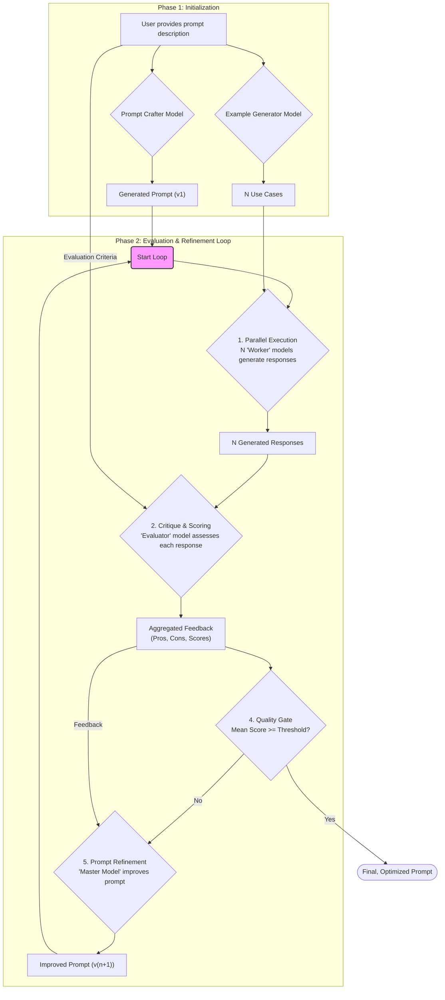

# Self-Improving Prompt Creator

This document outlines the architecture and workflow for a "Self-Improving Prompt Creator," an autonomous system designed to iteratively generate, evaluate, and refine AI prompts to meet a specified quality threshold.

The core idea is to leverage a multi-agent pipeline where different AI models collaborate to craft a prompt, test it against generated use cases, critique the results, and use that critique as feedback to improve the original prompt in a continuous loop.

## The Pipeline

The system operates in a cyclical, multi-stage process. It begins with a user's high-level description and ends with a highly optimized, battle-tested prompt.

### 1. Initialization Phase

1. **User Input**: The process starts when a user provides a natural language description of the prompt they need. This description outlines the prompt's goal, desired output format, constraints, and any other relevant context.
    * *Example User Input*: "I need a prompt that takes a business idea and generates a comprehensive SWOT analysis (Strengths, Weaknesses, Opportunities, Threats)."

2. **Initial Prompt Generation**: A "Prompt Crafter" model takes the user's description and generates a first-pass version of the prompt (`v1`).

3. **Use-Case Generation**: Concurrently, an "Example Generator" model creates a diverse set of `N` sample inputs (use cases) that are appropriate for the generated prompt. These examples will serve as the test suite for the evaluation phase.
    * *Example Use Cases (N=3)*:
        1. "An AI-powered subscription service for personalized meal planning."
        2. "A brick-and-mortar bookstore specializing in rare and antique books."
        3. "A mobile app that connects local volunteers with non-profit organizations."

### 2. The Evaluation & Refinement Loop

This is an agentic, iterative pipeline that continues until the prompt's quality score meets a predefined threshold.

1. **Parallel Execution**: The current version of the prompt is sent to `N` "Worker" models in parallel. Each worker is tasked with generating a response using the prompt and one of the `N` unique use cases created in the initialization phase.

2. **Critique & Scoring**: Once all `N` responses are generated, they are passed to an "Evaluator" model. The Evaluator assesses each response individually based on the original user description. For each of the `N` responses, it outputs:
    * **Pros**: A list of what the response did well.
    * **Cons**: A list of weaknesses, inaccuracies, or areas for improvement.
    * **Quality Score**: A numerical score (e.g., 1-10) representing the overall quality of the response.

3. **Aggregation**: The system aggregates all the feedback. It compiles a master list of all pros and cons and calculates the mean average of all `N` quality scores.

4. **Quality Gate**: The mean score is compared against a pre-defined quality threshold (e.g., `8.5/10`).
    * **If `mean_score >= threshold`**: The loop terminates. The current version of the prompt is considered successful and is returned to the user as the final output.
    * **If `mean_score < threshold`**: The process proceeds to the refinement step.

5. **Prompt Refinement**: A "Master Model" (or the original Prompt Crafter) is invoked. It is provided with:
    * The current (underperforming) prompt.
    * The aggregated list of pros and cons from the evaluation.
    * The original user description.

    Its task is to analyze the feedback and generate an improved version of the prompt (`v2`, `v3`, etc.) that addresses the identified weaknesses.

6. **Restart Loop**: The newly refined prompt replaces the old one, and the pipeline restarts from the **Parallel Execution** step, using the *same* `N` use cases to test the improved prompt. This ensures that improvements can be measured consistently against a stable benchmark.

### System Diagram

The following diagram illustrates the complete workflow, highlighting the core refinement loop.

